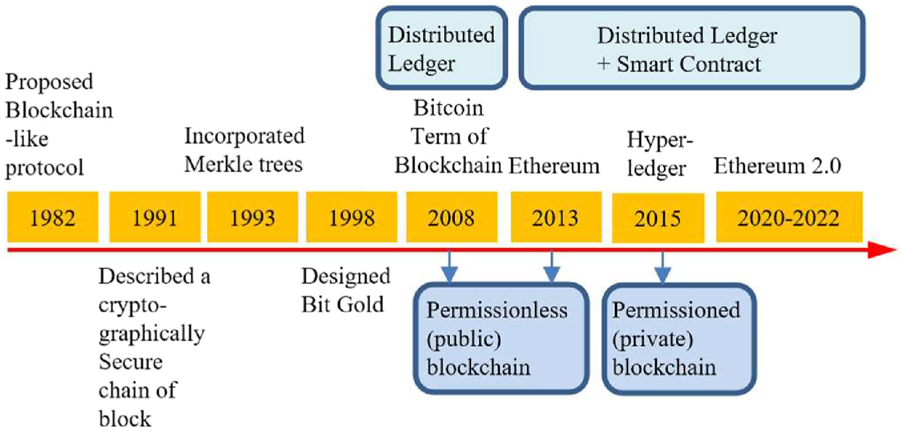
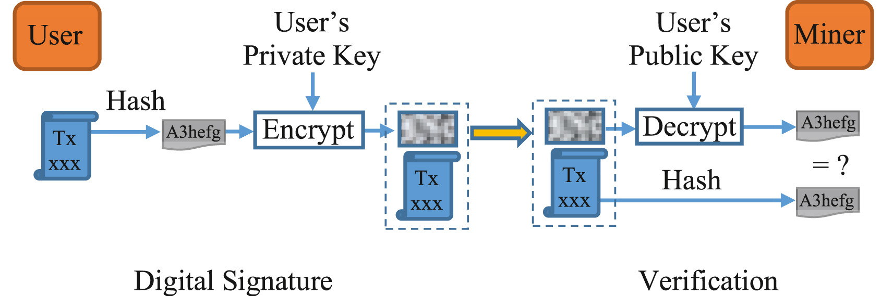
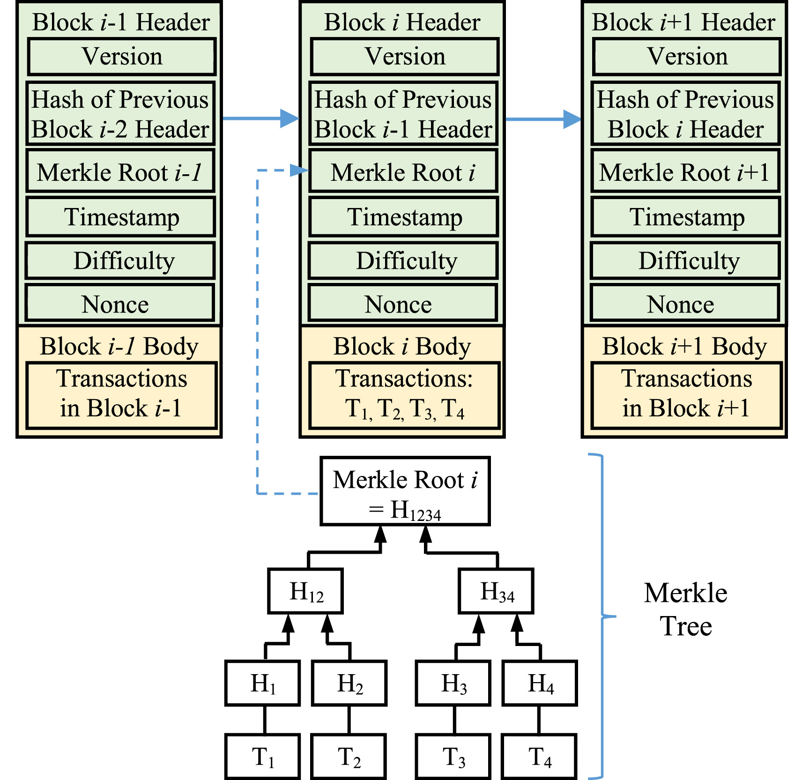
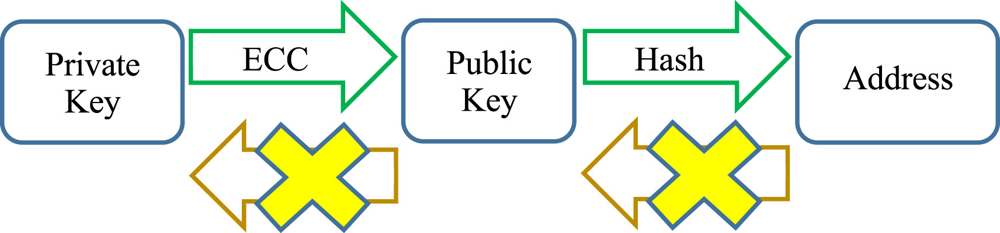
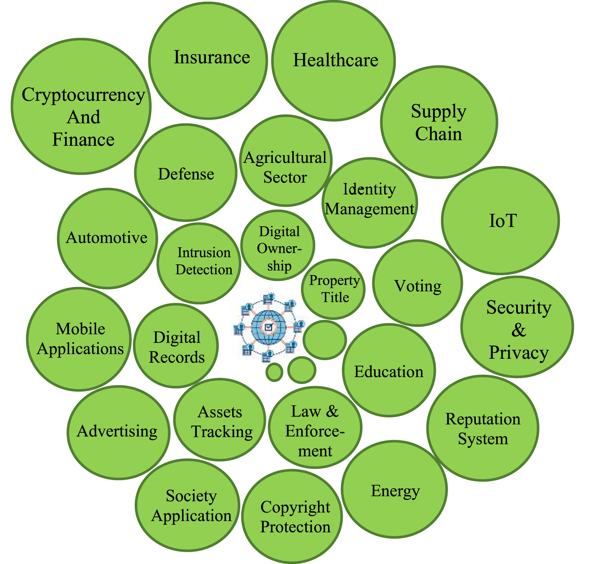

# 关于区块链技术及其安全性的调查
## 作者: 
Huaqun Guo, Xingjie Yu
## 摘要：
*区块链是一种具有去中心化、自治、完整性、不可修改性、可验证性、容错性、匿名性、可审计性和透明性等良好特性的技术。本文首先对区块链技术进行深入调查，特别是其历史、共识算法的数量比较、公钥加密、零知识证明和哈希函数在区块链中的细节以及区块链应用的综合列表。此外，本文重点关注区块链本身的安全性。特别是，我们从风险分析的角度评估区块链的安全性，得出了综合区块链安全风险类别，分析了对区块链的实际攻击和漏洞，并总结了最近开发的区块链安全措施。最后，我们提出了实现更可扩展和更安全的区块链系统并进行大规模部署所面对的挑战以及研究趋势。*

## 关键词：
区块链；共识算法；智能合约；风险；区块链安全

---

## 1 介绍
在区块链中，数据存储在分布式账本中。区块链技术提供了完整性和可用性，使得区块链网络的参与者能够在分布式账本中写入、读取和验证交易。然而，它不允许对已记录在其账本上的交易和其他信息进行删除和修改操作。区块链系统由密码学原语和协议支持和保护，例如数字签名、哈希函数等。这些原语保证了记录在账本中的交易受到完整性保护、真实性验证和不可否认性。此外，作为一个分布式网络，为了让整个参与者就一个统一的记录达成一致，区块链技术还需要一个共识协议，它本质上是每个参与者都要遵循的一套规则,以实现全球统一的观点。

在一个无信任的环境中，区块链为用户提供了去中心化、自治、完整性、不可修改性、可验证性、容错性、匿名性、可审计性和透明性等优良特性[1-3]。凭借这些先进的特性，区块链技术近年来在学术界和工业界都受到了极大的关注。

为了帮助和使人们更好地了解区块链技术和区块链安全问题，特别是为了使用区块链进行交易的用户和将要开发区块链技术并解决区块链安全问题的研究人员，我们付出了努力和时间，对区块链技术及其安全问题进行了全面调查和分析。首先，我们确定了关键词，包括区块链、调查、共识算法、智能合约、风险和区块链安全，以搜索互联网上的出版物和信息。其次，我们调查了在顶级安全会议和期刊中发表的与区块链相关的论文，例如USENIX安全研讨会、IEEE安全和隐私研讨会、IEEE交易期刊等。通过这种方式，我们调查了尽可能多的论文，以克服研究和结果偏差。我们的调查论文呈现了其他研究工作的全面发现。

我们调研的主要贡献包括：1）我们比较各种共识算法并进行详细分析和数字图表，以及介绍区块链的密码学基础；2）我们提供了有关智能合约及其安全性的丰富信息；3）我们探讨了广泛使用的区块链技术应用，包括但不限于不同的加密货币；4）我们对区块链本身的安全风险、实际攻击、漏洞、根本原因和最新安全措施进行了全面分析；5）我们总结和呈现了本文的挑战和研究趋势，以进一步努力开发面向大规模部署的区块链技术。

本文的剩余部分安排如下：第2节介绍概述。第3节详细描述区块链技术，包括共识算法、智能合约和区块链加密，而综合的区块链应用则在第4节中呈现。第5节介绍了区块链的安全风险和真实攻击，第6节描述了安全措施。第7节分析了区块链的挑战和研究趋势。第8节总结了相关的调研工作以展示我们的贡献。最后，第9节总结了我们的工作。

## 2 区块链历史概述
1982年，Chaum在其博士论文中首次提出了类似于区块链的协议[4]。1991年，Haber和Stornetta首次描述了一个具有密码学保护的区块链[5]。1993年，Bayer等人将Merkle树纳入到设计中[6]。1998年，Szabo设计了“比特黄金”——一种去中心化的数字货币机制[7]。2008年，Nakamoto推出了比特币，这是一种纯粹基于点对点网络的电子现金[8]。同年，区块链一词首次被引入，作为比特币交易背后的分布式账本[9]。

2013年，Buterin在他的白皮书中提出了以太坊[10]。2014年，以太坊的开发进行了众筹，并于2015年7月30日上线。以太坊的出现意味着区块链2.0的诞生，因为与所有专注于开发类似比特币的替代币种的各种区块链项目不同，以太坊使人们能够通过其自身的区块链在无需信任的分布式应用程序上进行连接。换句话说，虽然比特币是为分布式分类账而开发的，但以太坊是为分布式数据存储和智能合约（小型计算机程序）而开发的。以太坊2.0升级了以太坊网络，旨在提高网络的速度、可扩展性、效率和安全性。这些升级分为三个阶段，跨越了从2020年到2022年的时间。

在2015年，Linux基金会宣布了Hyperledger项目，这是一个针对区块链的开源软件。Hyperledger区块链框架旨在构建企业级区块链，与Bitcoin和Ethereum不同。在Hyperledger下有八个区块链框架，包括Hyperledger Besu、Hyperledger Fabric、Hyperledger Indy、Hyperledger Sawtooth、Hyperledger Burrow、Hyperledger Iroha、Hyperledger Grid和Hyperledger Labs，五个Hyperledger工具，包括Hyperledger Avalon、Hyperledger Cactus、Heperledger Caliper、Hyperledger Cello和Hyperledger Explorer，以及四个库，包括Hyperledger Aries、Hyperledger Quilt、Hyperledger Transact和Hyperledger URSA [11]。

区块链的历史总结如图1所示。比特币和以太坊是公共区块链，因为任何人都可以参与它们的区块链网络，也称为无许可区块链。各种Hyperledger区块链网络是私有区块链，因为参与者在加入网络之前需要进行验证，也称为许可区块链。

---

图1. 区块链的历史。

---

## 3 区块链技术
### 3.1 共识算法
匿名性作为区块链的一个期望特征，匿名性在建立信任时也会带来问题。如何保证匿名用户在向账本中添加交易时是诚实的呢？答案是验证每个交易是否合法（不是恶意的、双重支付等），然后将交易放入一个区块中。将一个区块添加到区块链中的协议是通过共识算法实现的。这些共识算法利用了在区块链上大多数用户有一个共同利益即保持区块链诚实的事实。区块链系统使用共识算法来建立其信任，并将交易适当地存储在区块中。因此，共识算法可以被认为是区块链上所有交易的核心。

共识协议本质上是每个参与者都必须遵循的一组规则。作为一种没有普遍信任的分布式技术，区块链需要一种分布式共识机制，让所有参与者都同意区块链的当前状态。区块链的共识基于稀缺性，即控制更多的稀缺资源可以更好地控制区块链的操作。针对区块链设计了一些独特的共识机制，包括工作量证明（Proof of Work，PoW）[8]、股权证明（Proof of Stake，PoS）[12]、委任股权证明（Delegated Proof of Stake，DPoS）[13]、消逝时间证明（Proof of Elapsed Time，PoET）[14]、实用拜占庭容错（Practical Byzantine Fault Tolerance，PBFT）[15]、有向无环图（Directed Acyclic Graph，DAG）[16,17]、权威证明（Proof of Authority，PoA）[18]、Tendermint [19]、Ripple [20]、可扩展拜占庭共识协议（Scalable Byzantine Consensus Protocol，SCP）[21]、带宽证明（Proof of Bandwidth，PoB）[22]、重要性证明（Proof-of-Importance，PoI）[23]、烧毁证明（Proof of Burn）[24]、容量证明（Proof of Capacity）[25]，根据其独特的需求而定。

基于其他调查工作中出现的算法[2,3,[26], [27], [28], [29], [30], [31], [32]]，工作量证明（PoW）、股权证明（PoS）、委任股权证明（DPoS）和拜占庭容错（PBFT）是最常见的共识算法。有向无环图（DAG）是最不同于其他共识算法的。PoET是由英特尔公司开发并在Hyperledger Sawtooth中使用。因此，下面将进一步介绍这六种共识算法。

**工作量证明（PoW）**:PoW选择一种只能通过猜测来解决的问题。例如，在创建和验证一个完整的区块的时候，问题是猜测符合难度要求（例如以四个零开头）的nonce值。网络上的每个节点（也称为挖矿节点）都在随机猜测不同的nonce值，直到一个节点首先发现与难度匹配的nonce值。因此，挖矿节点必须在其上花费大量计算资源（因此称为“工作”），才能比其他节点更快地解决问题，并成功创建一个区块链接到区块链上，从而获得一个挖矿奖励，通常是加密货币。另一方面，哈希函数是PoW共识算法中一个重要的密码学谜题。比特币网络采用密码哈希函数SHA-256[8]。我们将在以下部分更多地讨论哈希函数。比特币和以太坊公共区块链使用PoW作为它们的共识算法。PoW共识过程的一个重要问题是需要大量的时间和电力才能完成。

**股权证明 (PoS)**: PoS[12,33]是第二个最著名的共识方法，其对于挖矿所需的计算量要少于PoW。PoS解决了PoW存在的时间和电力消耗问题，因为电力需求与矿工找到一个随机数有关，而这个过程需要一定的时间。PoS要求节点提供抵押来被选择作为下一个块创建者。当一个块被选中，创建者将获得与该块相关的交易费用。如果一个块赢家试图添加一个无效块，其将失去他/她的抵押。在Ethereum 2.0升级的第一阶段中，区块链“世界计算机”从PoW共识算法切换到PoS。

**委任股权证明 (DPoS)**：在DPoS中，所有代币持有者都可以为多个代表投票，还可以将其投票权委托给其他用户。代币持有者持有的代币越多，其投票权就越大。然后代表负责验证交易和区块以保护网络[13]。与PoW中最大的计算能力或PoS中最多的代币不同，DPoS中的代币持有者可以投票决定谁来挖掘新块并仅奖励最佳矿工。 EOS是使用DPoS算法的区块链系统之一[34]。

**消逝时间证明 (PoET)**：英特尔公司开发了PoET算法，以实现一种不同的方式来确定挖掘区块的获胜者[14]。在PoET中，每个潜在的验证节点都会请求一个由可信计算平台（例如英特尔的SGX）生成的随机等待时间。等待分配的时间后，首个完成等待时间的节点将成为获得验证权的获胜者，从而能够添加新区块。可信计算平台使得每个节点都有获胜的机会[35]。

**实用拜占庭容错（PBFT）**：拜占庭容错（BFT）解决了一个著名的问题，即有些将军不诚实但需要达成正确的共识。PBFT是一种优化BFT的共识算法[16]。在PBFT中，只要恶意或敌对节点少于区块链系统中所有节点的三分之一，区块链系统就会在区块链的当前状态上达成一致。区块链系统中的节点越多，区块链越安全。Hyperledger Fabric目前使用PBFT。

**有向无环图 (DAG)**：与其他共识算法不同DAG[17]是由节点和连接节点的边构成的。节点和边是有向的，因为它们向一个方向移动，而且是无环的，因为节点不会回到自己。结构中的每个节点表示一个交易。这里没有区块的概念，也不需要挖掘来添加交易。相反，每个交易都建立在另一个交易之上。然而，当节点提交一个交易时，仍然会进行一小部分PoW操作。这可以确保网络没有被垃圾邮件攻击，并验证之前的交易。IOTA[36]采用了DAG共识算法。

这六种共识算法的比较列在表格1中。我们尽可能详细和量化地比较它们。

---

表1. 共识算法比较 [13，[37]，[38]，[39]，[40]]。

|  算法  |  PoW  |  PoS  |  DPoS  |  PoET  |  PBFT  |  DAG  |
|:-----------:|:-----------:|:-----------:|:-----------:|:-----------:|:-----------:|:-----------:|
|  设置  |  公共无许可/私有区块链  |  公共无许可/私有区块链  |  公共/私有区块链  |  私有有许可/无许可区块链  |  私有有许可区块链  |  公共有许可非区块链  |
|  成本和回报  |  进入成本相对较高，但回报高  |  进入成本较低，但回报较低  |  比 PoS 更低的成本和回报  |  进入成本非常低，但回报较低  |  所有人都参与但没有回报  |  所有人都参与但没有回报  |
|  奖励机制  |  获胜的矿工将获得在其验证的块和交易费用中的新币  |  获胜者将获得新块的交易费用；如果获胜者试图添加无效块，则会失去其股份  |  威胁到声誉和收入的损失为代表提供了诚实行动和保持网络安全的激励  |  获胜的矿工将获得其验证的新块中的交易费用  |  无  |  无  |
|  确定性  |  概率性的  |  概率性的  |  概率性的  |  概率性的  |  即时的  |  概率性的  |
|  网络中的可扩展性  |  高  |  中等  |  中等  |  中等  |  低（随着节点数量的增加，通信成本会快速增长）  |  高  |
|  能源效率  |  非常低（需要大量计算，例如，比特币每年消耗约121.36太瓦时（TWh）的能源）  |  高  |  高（不需要矿工）  |  高  |  中等（一些PBFT系统使用PoW防止攻击，但仅在一定数量的区块（即100个）之后，并非每个区块都使用）  |  中等（当节点提交交易时，进行一些小的PoW操作，以确保网络未受到垃圾邮件的攻击，并验证先前的交易）  |
|  51%攻击  |  攻击所需的恶意节点数量超过所有节点的25%  |  减少了51%攻击的可能性  |  如果代表们联合起来，组织51%攻击会更容易  |  减少了51%攻击的可能性  |  该算法能够抵抗节点总数的三分之一的恶意节点攻击。  |  未经大规模测试  |
|  易受Sybil攻击  |  不  |  是  |  是  |  不  |  是  |  不  |
|  实例  |  比特币、以太坊、莱特币、门罗币、达世币、Zcash、Decred 等  |  Ethereum 2.0、Cardano、Polkadot、BlackCoin 和 Peercoin  |  EOS、BitShares、Lisk、Steem、Ark、Nano、Cardano 和 Tezos  |  Hyperledger Sawtooth  |  Hyperledger Fabric、Zilliqa  |  IOTA  |
|  每秒交易数（TPS）  |  比特币：最高7-27个  |  以太坊：15个  |  EOS：3996个，BitShares：3300个  |  Hyperledger Sawtooth：2300个  |  Hyperledger Fabric：约3500个  |  IOTA：250个 IOTA Pollen V0.2.2：>1000个  |
|  区块确认时间（秒）  |  比特币：6000，莱特币：150  |  以太坊：15  |  EOS：0.5，比特股：3  |  没有实际时间  |  以秒为单位（没有实际时间）  |  120  |

---

### 3.2 智能合约
智能合约是区块链的另一个精彩组成部分，区块链不仅提供了分布式、不可更改的所有不同事件记录，还允许编写非常客观的计算机代码，明确定义了该过程的管理方式和在事件发生时要采取的步骤。以太坊中提出智能合约的一个目标是打破比特币的局限性。智能合约是关于编写针对某些重要事件作出响应的计算机代码。智能合约不一定涉及两个或更多方，并且不一定具有法律约束力[41]。

智能合约也被称为链码[41]：
- 将程序规则和决策点编入区块链交易和过程中。
- 自动化交易并确保它们都遵循相同的规则。
- 在区块链上运行。

智能合约将彻底改变我们的商业模式，是企业区块链应用的关键所在。任何人都可以开发智能合约，无需中介。智能合约提供了自主性、效率、准确性和节省成本的优势。

### 3.3 区块链的加密学
区块链创建了一层信任机制，使不信任的各方能够进行安全和可信的记录和交易。如果没有区块链来创建可信的记录和交易，就需要第三方中介机构。区块链利用加密和协作创建这种信任，并因此消除了需要集中机构作为中介的需求。区块链上的信息使用加密技术存储在分类账中。

区块链使用以下一些密码学构建块 [41]:
- 公钥密码学：用于数字签名和加密。
- 零知识证明：证明一个秘密的知识而不揭示它。
- 哈希函数：单向伪随机数学函数。Merkle树采用哈希函数来形成块头的一部分。

**公钥密码学**：它用于证明交易是由正确的人创建的。在区块链中，私钥保存在数字钱包中，可以是硬件钱包（用于存储私钥的物理设备）或任何软件钱包（例如桌面钱包应用程序、移动钱包应用程序或网络钱包）。用户访问其私钥以签署称为数字签名的消息，该消息将传输到区块链，并且其公钥是为了确认该消息确实来自用户。例如，在图2中，用户将其交易数据哈希为哈希值1，然后使用其私钥对哈希值1进行签名以生成数字签名。然后，用户将其数字签名与其交易数据一起发送到区块链网络。矿工使用用户的公钥解密接收到的数字签名以获得哈希值A，并且矿工还将接收到的交易数据哈希以获得另一个哈希值B。然后，矿工检查哈希值A是否等于哈希值B。如果它们相等，则矿工验证用户的交易。

---

图2. 区块链交易中使用的数字签名和哈希值。

---

由于私钥只有其所有者可以安全地保管，因此相应的数字签名确保了交易的作者身份。该算法取决于每个用户的私钥，使每个交易都能够使用数字签名。公钥和私钥的配对是区块链的支柱，它们用于签署和验证用户所进行的交易。

以太坊和Hyperledger Fabric都使用数字签名来确认交易和区块的创建者身份，并确认自签名以来签名数据未被修改。椭圆曲线数字签名算法（ECDSA）被广泛采用用于创建公钥和私钥对。

用户的公钥可以被逻辑上作为用户身份的选择，因为验证数字签名需要知道公钥。它被用作区块链中管理用户身份的方法，而不会暴露真实身份。

**零知识证明**：零知识证明在区块链中的主要用例之一如下所示。当一个用户请求向另一个用户发送一些钱时，区块链自然希望在提交此交易之前确认发送资金的用户有足够的资金。但是，区块链实际上不需要知道或关心谁在花费资金，或者他总共拥有多少资金。在这种情况下，区块链对于用户向谁发送资金以及该用户拥有多少资金没有任何信息。

零知识证明是一种用于某些区块链提高用户隐私的密码学原理。目前，以太坊不支持零知识证明，但是在以太坊开发路线图中包括了为 zkSNARKS（一种零知识证明）添加必要功能的计划。

**哈希函数**：哈希函数是区块链中使用的重要技术。哈希函数是一个具有五个重要密码学属性的数学方程：
- **固定大小**：哈希函数可以将任何内容作为输入并创建具有固定大小的输出。这使得任何内容都可以被压缩成一个固定大小的数据。因此，区块链使用哈希函数压缩数字签名的消息。
- **预像抗性**：给定一个输入，计算哈希输出并不难。然而，给定哈希输出，数学上不可能反向工程出原始输入。事实上，唯一可能的方法是随机地将数据输入哈希函数，直到产生相同的输出。
- **第二原像抗性**：如果已知一个输入和它的哈希输出，那么计算出另一个能够产生相同哈希输出的输入是计算上不可行的。
- **碰撞抗性**：在计算上找到任意两个不同的输入以产生相同的哈希输出是不可行的。
- **大变化**： 如果更改输入的任何单个位，它将产生完全不同的哈希输出。

图3显示了加密哈希函数提供了一种将区块链上所有区块连接在一起的方式。在区块级别上，前一个块i-2头的哈希存储在块i-1中，前一个块i-1头的哈希存储在块i中，前一个块i头的哈希存储在块i+1中，以此类推。

---

图3. 展示了区块链的连接结构和带哈希函数的Merkle树。

---

在一个区块中，包含多个交易。区块链还对每个交易进行哈希，并在图3底部的Merkle树中生成Merkle根哈希值，存储在块头中。通过这种方式，区块链创建了一个不可变、安全且极为可信的分布式账本。如果任何一个块或任何一个交易或该块上的任何信息被修改，无论多么微小，都会立即被发现，并且该块与所有后续块之间的链接将被断开。

**P2PKH地址**：除了前面提到的区块链连接结构、Merkle树和PoW挖矿算法之外，加密哈希函数也被用于比特币支付到公钥哈希（P2PKH）地址[42]。哈希函数和公钥密码学被用于创建比特币用户的P2PKH地址以便发送和接收资金（图4）。由于单向函数的作用，从地址反推其公钥和私钥是不可能的。

---

图4. 比特币地址的公钥密码学和哈希函数。

---

私钥的长度不会改变。私钥的大小为32字节，公钥的大小为65字节（或压缩公钥为33字节）。P2PKH地址的大小为20字节。

## 4 区块链应用
从调查中发现，区块链的应用包括加密货币、金融（证券交易所、金融服务、P2P金融市场、众筹等）、物联网（安全和隐私、电子商务等）、声誉系统（网络社区、学术界等）、安全和隐私（安全增强、风险管理、隐私保护等）[3]，医疗保健、保险、版权保护、能源、社会应用（区块链音乐、区块链政府）、广告[43]、国防、移动应用、供应链、汽车[28]、农业[44]、身份管理、投票、教育、法律执法、资产跟踪[45]、数字记录、入侵检测[46]、数字所有权管理、财产所有权登记等等。图5说明了区块链技术应用的螺旋式增长。预计会有越来越多的区块链系统使用案例出现。

---

图5. 区块链应用。

---

以下的子章节中，我们将选择加密货币作为第一个应用、供应链作为广泛使用的案例，以及Smart Dubai Office作为第一个整个政府服务应用，为读者提供更多信息。

### 4.1 加密货币
第一种加密货币是比特币，它于2008年宣布，2009年推出。比特币的最大数量是2100万个BTC。一旦一个挖矿节点（矿工）找到一个与难度相匹配的nonce值，并成功获得一个块被接受，该矿工获得一个交易费用（24美元和31美元）和6.25 BTC的挖矿奖励。每210,000个块（大约每4年），挖矿奖励减半。目前，已经挖掘出将近90%的比特币。在比特币之后，以太坊（ETH）的市值大约是比特币的19%，是目前排名第二的最大加密货币。Cryptoslate在其币种排名中列出了2403个市值前的加密货币[47]。其中，表2列出了在前面提到的共识使用示例中被提到的7种加密货币。

---

表2. 加密货币 [48]

|  |  推出年份  |  推出价格    |  2021年1月1日单位价格（美元）  |  2021年2月27日单位价格（美元）  |  2021年2月27日市值（美元）  |  已挖出的数字货币数量  |  总数字货币数量  |
|:-----:|:-----:|:-----:|:-----:|:-----:|:-----:|:-----:|:-----:|
|  比特币 (BTC)  |  2009  |  0.0008 美元  |  28,994.01  |  47,781.33  |  890.6 billion  |  接近90%  |  21,000,000  |
|  以太坊 (ETH)  |  2014  |  预售价：0.30美元、正式上线价：12.50美元  |  737.71  |  1502  |  172.5 billion  |  	114.84 ​M  |  目前没有实施硬顶，每年限制在 1800 万  |
|  艾达币 (ADA)  |  2017  |  0.019 欧元  |  0.31  |  1.36  |  43.4 billion  |  大约 71%  |  45,000,000,000  |
|  波卡 (DOT)  |  2020  |  1.2 美元 |  9.12  |  33.64  |  30.7 billion  |  1,049,328,830  |  没有最大供应量  |
|  莱特币 (LTC)  |  2011  |  4.3 美元  |  124.67  |  176.31  |  11.8 billion  |  大约79%  |  84,000,000  |
|  比特币现金 (BCH)  |  2017  |  543 美元  |  小于 400  |  501.3  |  9.4 billion  |  接近89%  |  21,000,000  |
|  柚子币 (EOS)  |  2017  |  2.29 美元  |  2.5975  |  3.68  |  3.5 billion  |  接近93%  |  1,027,393,754  |
|  IOTA  |  2016  |  未知  |  0.2969  |  1.1532  |  3.2 billion  |  2,779,530,283  |  2,779,530,283  |
						
---

加密货币的优点包括：
- 加密货币是区块链的良好应用案例，充分利用了区块链的先进功能。
- 支付直接从一个人到另一个人。
- 处理费用非常小。
- 发送资金没有延迟和限制。

加密货币的缺点包括：
- 没有管控，可能会导致黑钱的出现。
- 可能会遭受安全攻击并失去数字资产。
- 缺乏政府监管，可能会出台一些政策来管理或控制加密货币。
- 有些评论认为，投资加密货币非常风险和投机。例如，特斯拉在其SEC文件中警告投资者比特币价格的波动性[49]。

### 4.2 供应链
区块链技术提供了分布式账本，可以创建每个交易的永久和共享记录。所有记录的交易对于授权参与者都是可见的，可以在账本内追踪，不可篡改和不可撤销，这促使人们越来越多地使用区块链进行供应链数据共享。例如，IBM已发布了基于许可的区块链供应链数据共享解决方案，专注于物流[3]；而VeChain的冷链物流解决方案是使用区块链来跟踪和监控物流信息，以实现透明、规范、安全和可靠的数据共享[4]。在Makerchain[50]中，提出将独特的化学标记数据与区块链进行配对，作为一种防伪的方法。

此外，各种区块链技术被提出来增强供应链的安全性、透明度和可追溯性。在参考文献[51]中，区块链技术被用于保障工业4.0中的智能制造，以应对制造系统中的网络安全问题。在参考文献[52]中，区块链被用于从制造系统和产品生命周期管理的角度实现可持续性。ManuChain[53]基于权限的区块链网络被提出来消除个性化制造系统中全局规划和本地执行之间的不平衡/不一致问题。

### 4.3 智慧迪拜办公室
迪拜正在投资智能迪拜办公室，并实施区块链技术，将政府从服务提供者转变为在城市范围内的服务启用者。它正在各个层面资助区块链的实施。
- 政府服务使用区块链技术实施。
- 支持初创企业和企业创建区块链产业。
- 树立一个基于区块链技术构建的政府服务的先驱典范。

## 5 区块链的安全风险和攻击
由于区块链是去中心化的且没有任何第三方参与，需要确保在无信任基础设施上建立信任，因此对区块链本身的安全性进行研究是很有价值的。本节将重点介绍区块链技术的安全风险，并调查实际攻击和漏洞对区块链系统的影响。

### 5.1 区块链的安全风险
OWASP Top 10列出的十大Web应用程序安全风险在区块链技术上进行了分析和评估[54]，其评估结果总结在表3中。OWASP Top 10是一份广为人知的有关Web应用程序中最重要的安全风险的文件，表3显示区块链技术面临其中9个最高风险。因此，区块链的安全性是区块链业务应用成功的关键组成部分之一。

---
表3.区块链技术中前10个网络应用安全风险[54]。

|  Top 10 Web应用程序安全风险  | 区块链技术评估 |  分析示例  |
|:------:|:------:|:------:|
|  注入攻击  |  区块链技术中输入验证不足  |  在EOS主网启动之前，发现了EOS智能合约中缓冲区越界写的漏洞，以及运行恶意智能合约的潜力。  | 
|  认证失败  |  没有正确实现认证功能就存在大量的攻击面。  |  加密货币LISK就是一个允许攻击认证的例子。  |
|  敏感数据暴露  |  面临的潜在漏洞风险较高。  |  区块链公开数据易受数据挖掘的攻击，以获取有用信息；而且量子计算将会破解区块链上用于加密数据的公钥密码学。  | 
|  XML外部实体  |  不适用  |   |
|  断开访问控制  |  智能合约中的一个主要漏洞  |  例如Parity多重签名钱包中的两次攻击就是由于访问控制漏洞造成的。  |
|  安全配置错误  |  影响区块链安全  |  当以太坊钱包被配置为从端口8545接收外部命令时，攻击者利用一个漏洞窃取加密货币  |
|  跨站点脚本（XSS）  |   在某些方面影响区块链  |  受XSS攻击的区块链探索者可能显示不受信任的交易数据；区块链探索者和受XSS攻击的钱包都可以访问用户的私钥并控制他的帐户  |
|  不安全的脱序列化  |  可能会危及区块链系统  |  如果恶意用户控制交易数据，区块链系统可能会受到易受攻击的反序列化代码的危害  |
|  使用具有已知漏洞的组件  |  重用以太坊智能合约代码非常普遍  |  以太坊中超过 90% 的智能合约确实重用了代码，并且可能包含已知漏洞  |
|  日志记录和监控不足  |  日志所有者可以取消监视他们的日志  |  智能合约可能缺乏监控，黑客可能会利用其漏洞而不被发现  |

---

一个研究小组调查和分析了2009年到2017年5月间区块链系统的漏洞，并在表格4[29]中列出了9种低级别的区块链安全风险。

---
表4. 文献[29]中低级别的区块链安全风险类别。

|  序号  |  类别  | 
|:-----:|:-----:|
|  1  |  51%攻击漏洞  |
|  2  |  犯罪活动  | 
|  3  |  私钥安全  | 
|  4  |  交易隐私泄露  |  
|  5  |  双重支付  |  
|  6  |  恶意智能合约   |  
|  7  |  定价不当的操作  |  
|  8  |  智能合约的漏洞   |  
|  9  |  未经优化的智能合约   |  

---

另一研究小组从更高层面提出了区块链安全问题。他们指出，与传统计算机一样，区块链也面临拒绝服务（DoS）、端点安全、恶意滥用、代码漏洞和数据保护等潜在攻击，但发起攻击的细节有所不同[41]。除了DoS攻击，一些研究工作还提出了通过操纵路由广告的BGP（边界网关协议）劫持、通过延迟块的传播或隔离区块链网络的某些部分的路由攻击、通过隔离受害者使其脱离网络视野的日食攻击、通过将恶意的过渡自治系统（ASes）作为比特币节点的中间人网络来推断节点决策的EREBUS攻击、DNS攻击和远程侧信道攻击。我们将这些攻击归类为网络攻击类别。我们的论文增加了一类人为疏忽的风险类别，因为人类是任何系统的弱点。表5列出了攻击者可能利用的六类风险类别。

---
表5. 高层次的区块链安全风险类别。

|  风险  |  说明  |
|:-----:|:-----:|
|  网络攻击  |  如表1所示，区块链每秒交易数量有限，DoS攻击可能提交超过区块链能力的更多交易，导致区块链无法使用。除了DoS攻击，还有BGP（边界网关协议）攻击、路由攻击、日食攻击、隐蔽攻击、DNS攻击和远程侧信道攻击也属于此类别 别。  | 
|  端点安全性  |  端点可以是异构的，拥有更多的漏洞利用选项。端点也可以是同构的，一个系统的缺陷可能存在于所有系统中。  | 
|  有意的滥用  |  如表1所示，攻击者可能控制更多节点来发动类似51%的攻击。 |
|  代码漏洞  |  代码漏洞可能来自任何人都可以编写的智能合约或底层平台代码。漏洞具有广泛的影响，因为分布式网络和代码一旦部署就无法修改。有意编写恶意智能合约。  |
|  数据保护  |  数据保护依赖于区块链而不是数据所有者来提供数据的完整性和可用性。  |
|  人为疏忽  |  日志所有者可能会停止监视他们的日志。  |

---

结合表3、表4和表5，我们可以得到区块链安全风险的综合视图，如表6所示。我们还列出了一些其他低级别的安全风险，如钱包安全、Sybil攻击、个人密钥安全以突出其重要性，此外还有活性攻击、余额攻击、时间劫持攻击、菲尼攻击、竞争攻击和自持攻击，它们都被归类为恶意滥用类别。在表6中，我们清楚地看到代码漏洞是区块链上最容易被攻击的方面。在代码漏洞下，我们将代码分为核心软件代码，即区块链1.0和2.0构建的代码，以及只存在于区块链2.0中的智能合约。在核心软件代码下，我们强调钱包安全，因为相当多的攻击是针对钱包的。

---
表6. 综合区块链安全风险类别。

|  C1: 网络攻击  |  C2: 端点安全  |  C3: 故意滥用  |  C4: 代码漏洞  |  C5: 数据保护  |  C6: 人为疏忽  |
|:-----:|:-----:|:-----:|:-----:|:-----:|:-----:|
|  DoS（拒绝服务攻击）、BGP（边界网关协议）劫持、路由攻击、Eclipse 攻击、更隐蔽的攻击、DNS 攻击、远程侧信道攻击 |  51%漏洞、Sybil攻击、个人密钥安全、挖矿恶意软件、加密货币挖掘攻击  |  注入攻击、不安全的反序列化、51%漏洞、犯罪活动、双重支付、自私挖矿、存活攻击、余额攻击、时间劫持攻击、芬尼攻击、竞速攻击、自我持有攻击   |  **核心软件代码（区块链1.0，2.0）**：注入攻击、使用已知漏洞组件、安全配置错误、身份验证破坏、访问控制破坏、不安全的反序列化、XSS、交易隐私泄露、双重支付、私钥安全、钱包安全；**智能合约（区块链2.0）**：智能合约漏洞、恶意智能合约、低价操作、未经优化的智能合约 |  敏感数据泄露、隐私泄露  |  日志和监控不足，安全配置错误  |

---

### 5.2 对区块链系统的攻击和系统漏洞实例

在本文中，我们调查了一些针对区块链系统的攻击和漏洞实例，以提高人们对区块链系统安全性的认识。用户使用交易平台在区块链上进行交易，而在区块链上，私钥保存在数字钱包中。因此，交易平台和钱包是区块链系统的一部分。

#### 5.2.1 核心软件漏洞
在2010年8月发生的CVE-2010-5139漏洞是比特币网络中最著名的软件漏洞之一，因为其协议中存在整数溢出漏洞。由于这个缺陷，一个无效的交易0.5 BTC被替换成了184万亿BTC，并在正常区块中添加。解决这个问题花费了8个多小时[55]。此外，当比特币的版本从v0.7升级到v0.8时，存在一个bug，即在v0.8中处理的块在v0.7中无法处理，因为v0.8使用BerkeleyDB数据库，而v0.7使用LevelDB数据库。这个漏洞导致在使用v0.8的节点和使用v0.7的节点之间存在6个小时的不同区块链[55]。

#### 5.2.2 与加密货币交易所相关的攻击
2011年，攻击者利用网络协议缺陷从总部位于东京的比特币交易所Mt.Gox窃取了数千个比特币。2014年3月，由于比特币软件中的漏洞使得用户能够修改交易ID，Mt.Gox的在线储备金又被黑客窃取了65万个比特币，导致其破产[56]。2013年12月，匿名市场Sheep Marketplace因宣布其中一位供应商利用漏洞窃取了5400个比特币而被迫关闭[57]。2016年8月，黑客从第三大比特币交易所Bitfinex窃取了119,756个比特币[58]。2020年7月，黑客攻击了总部位于英国的加密货币交易所Cashaa，窃取了336个比特币以上。2020年8月，黑客攻击了欧洲加密货币交易平台2gether的服务器，窃取了139万美元[59]。

#### 5.2.3 针对数字钱包的攻击
区块链系统中的用户钱包存储了用户的凭据，并跟踪与其地址相关联的数字资产、用户凭据以及与其账户相关的任何其他信息。过去10年中发生了一些钱包攻击。

- 2012年9月5日，美元交易量排名第四的Bitfloor宣布，黑客入侵了Bitfloor的服务器，访问了未加密的钱包密钥备份并转移了24000 BTC [60]。
- 2013年4月3日，黑客入侵了Instawallet，窃取了3.5万BTC，并导致Instawallet无限期停止运营[61]。
- 2013年8月11日，比特币基金会宣布，黑客利用旧的伪随机数生成器的漏洞，解出了私钥并从用户钱包中窃取了余额[62]。
- 2013年10月23日和10月26日，一家澳大利亚比特币银行遭到黑客攻击，所有存储在美国服务器上的4100 BTC被窃取[63]。
- 由于Parity钱包中的多重签名漏洞，黑客于2017年7月19日通过攻击地址窃取了至少三个以太坊账户的30 M资金[64]。不幸的是，当时部署的Parity钱包库合约的新版本存在未被发现的初始化问题，导致另一个意外事故在2017年11月6日发生，受影响的多签钱包中的资金被冻结[65]。

#### 5.2.4 智能合约的攻击和漏洞
一个真实的智能合约攻击实例是针对在以太坊上构建的用于集体风险投资基金的DAO（去中心化自治组织）的特定智能合约，一名黑客利用其代码漏洞，于2016年6月17日窃取了价值超过5000万美元的加密货币[66]。黑客利用疏忽的智能合约编码来排空智能合约中的资金[67]。在2016年6月19日，Vitalik Buterin列出了以太坊合约中的漏洞类别，包括变量/函数命名混淆、本不应该公开的公共数据、重入（A调用B调用A）、由于2300燃气限制而发送失败、数组/循环和燃气限制以及微妙的博弈理论弱点[68]。

在2017年1月，Ether.Camp的Hacker Gold HKG发现了一个错误，合同代码中将“+=”写成了“=+”的错误[69]。2017年10月，SmartBillions发起了一个50万美元的黑客挑战赛，两名黑客在比赛被SmartBillions停止之前攻破了系统并窃取了400个ETH（价值12万美元）[70]。2018年1月，一名黑客在Proof of Weak Hands（PoWH）币的智能合约中发现了一个整数溢出漏洞，窃取了888个ETH [71]。2018年10月，一名攻击者针对Spankchain的智能合约发起了递归攻击，窃取了165.38个ETH。[72]

#### 5.2.5 网络攻击
在2014年8月，Dell SecureWorks反威胁组的一个研究小组发现，一名BGP劫持者重定向了加密货币矿工的连接到一个劫持者控制的挖矿池，并在四个多月内获得了矿工的收益，金额约为83,000美元 [73]。2016年9月，发现针对以太坊网络的一次分布式拒绝服务（DDoS）攻击，攻击交易每个块调用约50,000次的EXTCODESIZE opcode，从而大大降低了网络速度[74]。

#### 5.2.6 端点攻击
恶意软件是端点攻击的一种。根据一份报告，恶意软件感染了超过一百万台计算机，攻击者利用这些计算机挖掘了2600多万个加密代币[75]。加密货币挖矿是另一种端点攻击，攻击者通过在用户访问网站时在用户的Web浏览器中注入代码进行加密货币挖矿。攻击者在2017年黑客攻击了海盗湾[Pirate Bay][76]，CBS的Showtime[77]，并在2018年黑客攻击了印度政府网页[78]，利用访问者的计算机进行挖矿并获得挖矿奖励。攻击者还在第三方软件（例如，2017年的Google Tag Manager[79]和WordPress [80]，以及2018年的Drupal [81]）和广告（例如，2018年的YouTube广告 [82]）中注入了加密货币挖矿代码。2018年，还有20万个MikroTik路由器感染了恶意软件进行加密货币挖矿[83]，并在2017年破坏了布宜诺斯艾利斯的星巴克咖啡店的WiFi网络[84]，利用被感染的计算机挖掘加密货币。

#### 5.2.7 IOTA遭受的攻击
在2019年1月，黑客发起了网络钓鱼攻击，收集用户的隐私密钥长达六个月，然后窃取了价值3.94百万美元的用户IOTA[85]。与此同时，IOTA网络还遭受了DDoS攻击，以至于IOTA的开发人员忙于发现黑客的盗窃活动[85]。2020年2月，为阻止攻击者窃取资金，IOTA基金会不得不关闭负责确认所有交易的协调节点超过12天。黑客们打破了IOTA自己设计的哈希函数，能够伪造交易[86]。

考虑到Hydra [87]和KEVM [88]，我们在表6的基础上，总结了攻击、攻击年份、基于表6的类别、利用价值和根本原因，并在表7中进行了概述。以当前比特币和以太坊价格计算，这些攻击所能造成的损失总额超过400亿美元。因此，黑客一直有动力攻击区块链系统以获得巨大的利益，而这种情况将继续存在。

---
表7. 攻击、年份、类别、攻击利益和根本原因。

|  攻击  |  年份、类别  |  利用价值  |  根本原因  |
|:-----:|:-----:|:-----:|:-----:|
|  Mt. Gox  |  2011、C1  |  几千比特币  | 网络协议缺陷|
|  Bitfloor  |  2012、C2  |  2.4万比特币（价值25万美元） |  Bitfloor的服务器被黑客攻击，泄露了未加密的钱包密钥备份  |
|  Instawallet  |  2013、C4  |  3.5万比特币  |  Instawallet被黑客攻击  |
|  Bitcoin基金会  |  2013、C6  |  |  旧的伪随机数生成器存在漏洞  |
|  Sheep Marketplace  |  2013、C4  |  5400比特币  |  一个网站销售商利用了一个漏洞  |
|  Mt. Gox  |  2014、C4  |  65万比特币（价值4.5亿美元）  |  软件中的一个漏洞允许用户修改交易ID  |
|  Dell SecureWorks  |  2014、C1  |  8.3万美元  |  BGP劫持攻击  |
|  DAO  |  2016、C4  |  5千万美元  |  代码弱点：微妙的博弈理论漏洞  |
|  Bitfinex  |  2016、C2&C4  |  11.9756万比特币（价值6,500万美元）  |  黑客窃取了比特币  |
|  以太坊网络  |  2016、C1&C4 |  -  |  DDoS攻击：每个区块调用EXTCODESIZE操作码大约50,000次  |
|  Gold HKG  |  2017、C4  |  -  |  合约代码中存在一个错误，将“+=”写成了“=+”  |
|  Parity钱包  |  2017、C4  |  3千万美元  |  地址遭到攻击（委托调用+暴露自毁功能）  |
|  SmartBillions  |  2017、C4  |  400 ETH（价值12万美元）  |  侵入智能合约，破坏了缓存机制  |
|  Parity钱包  |  2017、C4  |  300万美元  |  未发现的错误：未进行正确初始化（委托调用+未指定修改器）  |
|  加密货币挖矿劫持  |  2017–2018、C2&C4  |  -  |  被黑客入侵并插入加密挖矿脚本或加密货币劫持代码  |
|  PoWH  |  2018、C4  |  888 ETH  |  整数溢出  |
|  Spankchain  |  2018、C4  |  165.38 ETH  |  重入攻击  |
|  IOTA  |  2019、C2  |  394万美元  |  收集用户私钥的网络钓鱼攻击  |
|  IOTA  |  2020、C4  |  -  |  自定义哈希函数被破坏  |
|  Cashaa  |  2020、C2  |  超过 336 比特币  |  怀疑系统中安装了恶意软件  |
|  2gether  |  2020、C2  |  130万美元  |  2gether 的服务器被黑了  |

---
注：C1：网络攻击，C2：端点安全，C3：故意误用，C4：代码漏洞，C5：数据保护，C6：人为疏忽；DAO：分散自治组织；PoWH：弱手持证明。

## 6 区块链的安全措施
### 6.1 安全性分析
**智能合约字节码漏洞分析**：2016年，Oyente被开发出来用于发现智能合约中潜在的安全漏洞 [89]。2018年，Securify被提出作为一种安全分析器，可以自动证明以太坊智能合约的不安全/安全 [90]。2018年，ZEUS使用符号模型检查和抽象解释来验证公平性并确认智能合约的正确性，约94.6%的合约被评估为易受攻击 [91]。表8列出了著名的智能合约字节码漏洞分析工具。除了Oyente、Securify和ZEUS之外，有兴趣的读者可以通过它们的参考资料找到更详细的分析工具信息。

---
表8. 智能合约字节码漏洞分析工具及功能比较。

|  智能合约分析工具  | 分析领域 |  检测到漏洞  |  分析的智能合约数量  |  易受攻击的智能合约数量  |  备注  | 
|:-----:|:-----:|:-----:|:-----:|:-----:|:-----:|
|  Oyente [92]  |  符号执行  |  时间戳依赖，交易顺序依赖，异常处理不当，重入漏洞  |  19,366  |  8,833  |  第一个基于符号执行的工具  |
|  Mythril [93]  |  符号执行  |  整数下溢、所有者覆盖到以太币提取等  |  未知  |  有，但没有给定具体数量  |
|  teEther [94]  |  符号执行  |  错误的可见性、错误的构造函数、语义混淆、逻辑漏洞、合同间漏洞  |  38,757  |  815  |
|  Manticore [95]  |  符号执行  |  未受保护的函数、整数溢出、未定义的行为、配置错误、数字问题、时序攻击漏洞、业务逻辑  |  100  |  有，但没有给定数量  |
|  ZEUS [91]  |  抽象解释  |  重入、发送失败、未经检查的发送、整数上溢/下溢、交易状态依赖、逻辑错误、逻辑缺失、区块状态依赖、逻辑正确但不公平、交易顺序依赖  |  22, 493  |  21, 281 (94.6%)  |  根据用户定义的策略检查用 Solidity 编写的智能合约  |
|  MAIAN [96]  |  符号执行  |  完整的合约执行跟踪，即有泄漏的合约、浪费的合约、自杀式合约、贪婪的合约。  |  970,898  |  34,200  |  通过长调用序列检测智能契约  |
|  Securify [90]  |  数据流分析  |  以太流动性、无限制写入、调用后无写入、有限制的转账、异常处理不当、交易顺序依赖、意外参数   |  以太坊虚拟机 (EVM)：24, 594; Solidity 数据集：100  |  6.50%  |  探索所有合约行为  |
|  Vandal [71]  |  抽象解释  |  重入攻击、未安全保护的余额、使用 ORIGIN、可销毁合约、未经检查的发送  |  141,000  |  有，但没有给定数量  |  将字节码转换为语义逻辑关系  |
|  MadMax [97]  |  抽象解释  |  无限制的大规模操作、整数溢出、钱包破坏中的非隔离外部调用、激励攻击  |  633万  |  5.42%  |  一种用于查找基于gas的漏洞的工具  |
|  Osiris [98]  |  符号执行  |  整数错误：截断错误、算术错误和信号相关的错误  |  120万  |  42,108  |
|  ETHBMC[94]  |  符号执行  |  主要用于提取以太币、重定向控制流、自毁合约、Parity漏洞等各种攻击  |  约220万  |  5905  |  它能够更精确地推理EVM内部的执行过程  |

---

在表8中，所有工具都检测出了一定数量的智能合约漏洞，尽管有些工具能够检测到更多的漏洞和/或检测到更多易受攻击的合约。换句话说，开发者应该高度关注设计智能合约，以抵御已知或未知的攻击，因为并不是所有合约都足够安全。表中还列出了各个工具的其他特点，以便用户更多地了解智能合约分析工具。

**交易和交易日志分析**：2020年，TxSpector [99] 成为第一个针对以太坊交易进行字节码级、基于逻辑的分析的通用框架，可以检测攻击，例如重入、未经检查的调用、自杀漏洞、时间戳依赖、源地址误用、发送失败、异常处理不当、未保护的余额和拒绝服务等。基于交易日志，还在2020年提出了一个Ever-evolving Game，用于分析现实世界中的攻击和自然环境中采用的防御方法 [100]。

**蜜罐智能合约**：黑客们不仅利用智能合约的漏洞，还开发了带有隐藏陷阱的蜜罐智能合约。2019年，HONEYBADGER被开发出来，对超过200万个智能合约进行分析，识别出690个蜜罐智能合约 [101]。

**共识算法分析**：2016年，ETH Zurich和NEC Laboratories的一组研究人员提出了一个框架，用于定量分析PoW的安全性和性能 [102]。2019年，张和Preneel评估并表明，PoW无法达到理想的区块链质量，也无法抵抗自私挖矿、双重支付和羽状分叉等攻击 [103]。

### 6.2 检测恶意代码和漏洞
在2018年，姜等人提出了ContractFuzzer来模糊测试智能合约以检测漏洞[104]，刘等人在他们的演示论文中介绍了基于模糊测试的分析器ReGuard，用于自动检测智能合约中最常见的漏洞类型——重入漏洞[105]。Breidenbach等人开发了Hydra，利用漏洞赏金来奖励发现的关键漏洞并进行运行时检测[87]。在2019年，提出了EVMFuzzer，采用差分模糊测试技术，通过不断生成种子合约作为目标EVM的输入，基于执行结果来检测EVM中的漏洞[106]。在2020年，提出了一种轻量级的测试生成方法——HARVEY，用于有效地检测智能合约的安全漏洞和缺陷[107]。

### 6.3 核心软件代码安全
2017年，SmartPool 作为一种去中心化的挖矿池被设计出来，旨在防止接近80%的以太坊和95%的比特币挖矿算力集中在少于6个和10个挖矿池中的现象[108]。2019年，Drijvers等人指出了两轮多重签名方案的微小缺陷，并提出了mBCJ作为一个可证明安全但高效的替代方案[109]。2020年，Drijvers等人提出了Pixel，一种基于对数对的前向安全多重签名方案，可抵御后验损坏攻击[110]，而Sun等人提出了Counter-RAPTOR来减轻和检测主动路由攻击[111]。

### 6.4 安全智能合约
在2016年，Luu等人提出了一些方法来增强以太坊操作语义，以减少智能合约的漏洞[92]。同年，Town Crier被开发出来，用于确保只有经过身份验证的数据才能输入智能合约[112]。2018年，FSolidM作为一种工具被提出，使开发人员能够将安全智能合约定义为FSM（有限状态机）并增强安全性和功能性[113]，而Arbitrum则旨在验证虚拟机将要执行的操作，以提高可扩展性和隐私性[114]。2020年，韩国大学的一个研究小组描述了VERISMART，以确保算术安全性来解决以太坊智能合约的安全问题[115]。

### 6.5 智能合约验证
在2018年，Amani等人创建了一个程序逻辑，用于在字节码级别上扩展现有的EVM正式化，以正式验证EVM智能合约[116]，而Abdellatif和Brousmiche提出了一种正式建模方法，用于验证智能合约的区块链和用户行为[117]。在2020年，Sun和Yu建立了一个框架来验证智能合约的安全漏洞，例如Binance Coin（BNB）合约[118]，Permenev等人提出了VerX，以自动验证Ethereum智能合约的功能属性[119]。

### 6.6 隐私保护
2016年，Hawk被开发出来，通过私有智能合约保护交易的隐私，而不在区块链上存储明文[120]。2018年，Obscuro被提出，提供了一个安全高效的比特币混币器，使支付者和收款人无法联系在一起，从而实现匿名支付[121]。2019年，Ouroboros Crypsinous被描述为分析隐私保护的PoS协议[122]，而BITE被开发出来，使轻量级客户端能够进行隐私保护的请求[123]。2020年，Zexe被证明能够实现一些流行应用的隐私保护模拟[124]。同年，还有关于接收方隐私的远程侧信道攻击被提出[125]。

### 6.7 针对黑客钱包的监控和监管
加密货币交易平台可以冻结来自被黑客攻击的钱包的任何资金。新的反洗钱（AML）法规正在实施，以使黑客难以移动这些资金 [126]。

### 6.8 硬分叉
为了应对 DAO 被黑客攻击的问题，以太坊被分成了经典以太坊 (Ethereum Classic) 和新以太坊 (the new Ethereum)。作为原软件的硬分叉，新以太坊能够保护免受进一步的恶意软件攻击。经典以太坊拥有被称为 ETC 的代币，而新以太坊则拥有被称为 ETH 的代币。在区块 1,920,000 之前，新以太坊和经典以太坊都有共同的祖先。

## 7 挑战与研究趋势
已有一些调查研究展示了区块链技术的未来趋势或范围。在文献[3,27]中，同一研究小组列出了区块链测试、大数据分析、区块链应用、智能合约、阻止中心化趋势和人工智能。在文献[29]中，提出了混合共识机制、更高效的共识机制、代码混淆、可信计算执行，以应对隐私泄露风险、应用加固和高效的数据清理和检测机制。文献[45]提出了标准化测试机制、大数据分析、智能合约开发和评估。文献[44]中描述了解决区块链技术中的漏洞、更多的应用场景和应用，以及提高对区块链技术的认知。除了这些有效的趋势和范围，本文将重点关注以下挑战和研究趋势。

### 7.1 可扩展性
**在交易方面的可扩展性**：在表1中，比特币的最大TPS（每秒交易数）为27，而EOS则为3996。PoW能够全球处理10到27 TPS之间的交易。以太坊2.0将升级并切换到更高效的PoS协议，以使以太坊更具可扩展性，并支持1000多个TPS [127]。在EOS中，使用DPoS共识算法的少数代表有投票权和验证区块的权利，因此EOS更为集中，一些代表更容易联合起来发起51%攻击。如果节点数量增加，PBFT中的通信成本会迅速增长，因此它适用于没有大量节点但有许多交易的私人设置。目前，基于PBFT的Hyperledger Fabric实现了约3500 TPS。基于PoET的Hyperledger Sawtooth实现了2300 TPS。

2019年，Perun被提出作为一个离线支付通道系统，代替在区块链上的交易以提高TPS[128]，并为PoS侧链系统提供了一个侧链结构以实现可扩展性[129]。2020年，于杰等人提出了OHIE作为一种无许可协议，将交易吞吐量提高到4-10 Mbps [130]。目前，以太坊和比特币平均只能处理约5KB或10TPS。因此，OHIE可以实现8000-20000 TPS。另一方面，在2017年8月宣布，维萨支付网络可以处理超过65,000 TPS[131]。因此，区块链在TPS方面的可扩展性在实际分布环境中仍然是一个突出的挑战。

**链数据共享的可扩展性**：比特币、比特币现金和以太坊的块大小分别为1MB、8MB到32MB之间和不到60KB。IBM区块链供应链解决方案[132]和VeChain[133]在区块链上记录共享数据，这限制了它们解决方案的可扩展性。可能会涉及大量利益相关者，需要共享的数据可能是庞大的，并且不限于物流数据。随着越来越多的利益相关者加入和共享数据的增长，链上数据共享系统将面临可扩展性问题的危险。

为了增加可扩展性并充分利用区块链技术，数据可以在一个专门的链下通道上共享，而链上记录数据共享的链接甚至证明可用于追溯和审计。链下数据共享解决方案需要企业间通道，这增加了企业建立和维护这些通道的负担。此外，这些解决方案不能保证由企业共享的数据的完整性。例如，A公司可以篡改原始数据以使数据符合B公司的特定要求，然后与B公司共享数据。为了减轻涉及公司的负担，数据可以定位和共享在云平台上。我们在这个领域提出了一项基于区块链的供应链访问控制和数据共享框架技术，可以参考我们的专利申请文件[134]。

### 7.2 更安全的软件代码
从表8中，我们可以知道几乎每年都发生了针对软件代码和智能合约的攻击。安全是任何资产相关软件的不可协商的方面。智能合约对安全性的要求很高，因为智能合约涉及到许多有价值的信息，例如加密货币、代币和其他数字资产。使用智能合约构建的交易是不可逆的，而智能合约的软件代码如果发现漏洞很难被修改或修补[135]。为了保护区块链环境免受攻击者的攻击，智能合约受到一些限制。除了账户和交易通过密码学哈希链不可变和安全外，例如，EOS面临着确保智能合约执行以经受恶意攻击的挑战[136]。2020年，有一项研究工作“Flash Boys 2.0”继续显示智能合约的风险，即套利机器人和矿工通过智能合约的交易顺序依赖性提取可提取价值，这对以太坊构成了现实威胁[137]。根据参考文献[135]，确保智能合约代码的安全性非常困难，因此保证智能合约的安全性是区块链面临的重要挑战之一。

### 7.3 审计、零信任和异常检测
**智能合约审计**：在部署智能合约之前，还需要进行一步审计。2018年，Erays被提出，将智能合约反向工程成高级伪代码，然后手动分析几个合约属性[138]。未来的研究趋势之一可能是进一步开发审计工具，以自动审计更多或所有智能合约属性。

**用于端点安全的零信任网络访问**：表7还清楚地显示了端点安全的重要性，包括需要安全保护用户凭据、确保钱包安全、加强服务器保护以及防止钓鱼攻击、内部攻击和其他未知攻击的服务器安全。因此，持续验证端点的零信任网络访问是未来的研究趋势之一。

**监控和异常检测**：网络监控和攻击/异常检测是区块链安全的持续努力。除了现有的分析方法[139]，对交易、日志、行为和数据进行机器学习、深度学习和联合学习分析将是保障区块链系统的研究趋势之一。2020年，ETH-EDS使用随机森林分类来检测Eclipse攻击[140]，这是使用机器学习技术进行攻击检测的一个例子。

### 7.4 隐私保护
随着越来越多的数据存储在区块链上，组织和个人关注的一个问题是隐私泄露。代码混淆、同态加密、可信执行平台（例如Intel SGX）以及用于隐私保护的智能合约等技术将是有前途的方向。

### 7.5 量子计算对区块链的影响
**ECDSA**是用于区块链交易签名的算法，公钥是通过一个易于计算的一方向椭圆曲线乘法函数从私钥中计算出来的，但是由于解离散对数问题的困难性，无法反向工程实现除法来获得私钥。这意味着需要花费天文数字的时间才能够解决这个问题，因此在区块链中，用户可以使用他们的私钥对数字签名进行签名，以表明他们对资产的所有权。

IBM、英特尔、谷歌、Rigetti、D-Wave、IonQ、微软和主要国家正在积极参与量子计算的研究和开发。1994年，Shor发表了一种量子算法，可以破解公钥密码学的大多数常见算法的安全性假设 [141]，而改进的Shor算法则有可能破解ECDSA [142]。

Ethereum开发者正在测试新的量子抗性签名算法，例如XMSS、哈希阶梯签名和SPHINCS，并且Ethereum 2.0 Serenity更新将替换ECDSA方案。后量子算法仍然是量子计算机的难题。美国国家标准技术研究所（NIST）正在处理和标准化具有量子抗性的公钥加密算法。2020年7月，NIST从第二轮名单的26个后量子密码学算法中选择了15个算法，并且现在这些算法正在进行第三轮公开审查 [143]。

**地址**：哈希函数的原像抗性确保在给定P2PKH地址的情况下，反推出其公钥在数学上是不可能的。如果其公钥未知，量子计算机无法推导出其私钥。但是，一旦从特定的P2PKH地址转移任何金额的资金，其公钥将被披露以验证其交易数字签名，因此其私钥在量子计算机下不再安全。最糟糕的情况是，收件人的公钥直接用作比特币地址，称为“支付到公钥”（P2PH）。一项分析显示，约25％的所有比特币（超过4百万BTC）有可能受到量子攻击[144]。

区块链社区还必须解决量子计算对区块链的影响。只有后量子密码学才能抵御量子攻击。其中一项研究趋势是研究如何将后量子密码学应用于构建强大和抗量子的区块链。然后，它将不得不对区块链进行硬分叉，例如区块链3.0，它实现了新的后量子密码协议，并与当前的区块链不同。

### 7.6 IOTA安全
随着比特币和基于以太坊的加密货币遇到可扩展性和交易费用的问题，IOTA可能是一个不错的替代选择，因为它使用的是DAG而不是区块和链的完全不同的顶点和边结构。使用Tangle技术，IOTA声称非常具有可扩展性，没有任何限制，并且不收取任何交易费用。然而，Tangle技术面临着一些问题，例如无法正确存储交易的顺序[145]以及他们自己设计的IOTA哈希函数Curl存在漏洞。IOTA需要克服这些挑战。当该技术成熟时，预计将在物联网行业广泛采用，这是一个迅速增长且具有巨大潜力的领域。

### 7.7 法规和标准问题
首先，预计加密货币将越来越流行，这将为基金交易带来方便和节省成本。另一方面，它也削弱了国家的金融政策和控制。其次，更多的国际区块链应用正在涌现。例如，区块链系统被用于验证COVID-19疫苗接种证明。因此，需要在不同国家之间建立法规和协议，以相互接受存储在区块链系统中的接种证明。第三，在同一国家内，多方需要同意将区块链用作共同基础设施，这可能是一个巨大的挑战，更不用说制定一个共同的国际标准了。因此，监管和标准将是大规模部署区块链系统的挑战之一。

## 8 相关工作
有一些关于区块链的综述论文。在2017年1月，Sankar等人描述了三种广义的区块链类型，并对三种共识算法（即Stellar共识协议、Corda和Hyperledger Fabric）进行了定性分析和比较 [26]。在2017年6月，郑等人对区块链架构进行了调查，包括区块链类型，对共识算法进行了比较，并提出了隐私泄露和自私挖掘的漏洞以及迁移解决方案[27]。在2017年8月，Ji.H. Park和Jo.H. Park对区块链结构和比特币进行了调查，介绍了安全挑战，包括大多数攻击（51%攻击），交易安全，软件安全和钱包安全，并将区块链安全适应于云计算[55]。另外一份于2017年8月上线的工作对区块链安全进行了调查，包括2017年之前的安全风险、真实攻击和和学术安全增强。在2017年9月，林和廖提出了51%攻击的安全问题和一些挑战，包括分叉问题、数据同步和确认时间、监管和集成成本问题[2]。

在2018年5月，肯尼索州立大学的一项研究提出了使用区块链和加密技术来确保各种区块链应用的数据机密性、真实性、完整性和隐私保护，而不是保护区块链本身的安全性[28]。在2018年10月，郑等人对区块链技术进行了一项调查，包括共识算法、应用程序、可扩展性方面的挑战、隐私泄露、私有挖掘，并提出了关于区块链测试、大数据分析、停止向中心化的趋势、智能安全分析和人工智能等未来发展方向[3]。在2018年11月，突尼斯的研究人员对区块链的挑战和安全性进行了调查[146]。在2018年12月，陈等人仅调查了不同领域中的区块链应用程序[43]。

在2019年8月，Monrat等人对区块链架构进行了调查，包括交易过程、区块结构和区块链的特点、区块链的类别、共识过程、区块链应用、权衡以及区块链技术的未来范围 [45]。2019年11月，Dave等人调查了区块链技术在农业、教育、供应链管理、医疗保健等领域的应用情况 [44]。2020年3月，Aguiar等人调查并使用区块链技术提高医疗保健安全性和可靠性，并增强患者隐私 [30]。一份在2019年12月收到并于2020年4月发布的调查工作介绍了区块链技术、应用和问题，包括可扩展性、无利益冲突等 [31]。2020年，Saad等人对区块链攻击面进行了系统概述 [147]。2021年1月，Berdik等人提出了他们的区块链调查论文，以确保信息的完整性和安全性 [32]。

有一些有关区块链安全的调查论文。2019年，Dasgupta等人调查了区块链的潜在漏洞，并展示了区块链的发展趋势[148]。2020年，Leng等人从过程层面、数据层面和基础设施层面研究了区块链安全，以确定研究空白并提出未来的研究方向[149]。

Table 9总结了与本文相关的调查工作和我们在本文中的工作。这也清晰地展示了我们在本文中的贡献。首先，我们尽可能提供了更多有关共识算法的定量比较，而其他调查只提供了部分比较。其次，本文的焦点是区块链本身的安全性，而大多数先前的调查只部分呈现或未呈现此点，有些关于区块链安全性的调查论文分别从过程、数据和基础设施层面对安全性进行了调查。在本文中，我们从风险分析的角度评估了区块链安全性，得出了综合的区块链安全风险类别，分析了针对区块链的真实攻击和错误以及根本原因，并介绍了最近开发的区块链安全措施。最后，表9显示其他调查论文分别涵盖了2到7个领域，而我们的工作则更全面地调查了区块链的8个领域。

---
表9. 不同调查研究的摘要。

|  调查研究  |  区块链类别  |  共识 定性比较   |  协议  定量比较    |  应用  |  可扩展性  |  区块链安全  |  量子计算  |  未来方向  |
|:-----:|:-----:|:-----:|:-----:|:-----:|:-----:|:-----:|:-----:|:-----:|
| [26] | 是 | 是 |   |   |   |    |    |    |
| [27] | 是 | 是 |   |   | 是 | 部分 |    |  是 |
| [55] |    |    |    |   |    | 部分 |    |    |
| [2,28] | 是 | 是 |   | 是 | 是 | 部分 |    |    |
| [3] | 是 | 是 | 部分 | 是 | 是 | 部分 |    |  是 |
| [150] |    |    |    | 是 |   |    |    |     |
| [29] |    | 是 |   |   |   | 部分 |    |  是 |
| [30] |    | 是 |   |   |   |    |    |     |
| [31] | 是 | 是 | 部分 |   | 是 | 部分 |    |     |
| [32] |   |    |   | 是 |   |    |    |     |
| [45] | 是 | 是 | 部分 | 是 | 是 |    |     |  是 |
| [44] |    |    |   | 是 |   | 部分 |    |  是 |
| [146] | 是 | 是 |   | 是 |   | 部分 |    |   |
| [147] |    | 是 | 部分 |   |   | 部分 |    |  是 |
| [148] |    |    |   | 是 | 是 | 漏洞调查 | 是  |  是 |
| [149] |    | 是 |   | 是 | 是 | 检查流程、数据和基础架构级别的安全性 | 是  |  是 |
| This paper | 是 | 是 | 尽可能多 | 是 | 是 | 全面的区块链安全风险类别、真实攻击、错误和根本原因、最近的安全措施 |  是 |  是 |

---

## 9 结论
本文首先对区块链技术进行了更深入的调查，涵盖了概述、共识算法、智能合约和密码学等方面。它介绍了区块链的历史，并尽可能详细和数量化地比较了五种最常见的共识算法和一种最不同的共识算法。为了保证区块链系统的完整性、身份验证、不可否认性和区块链系统所需的付款地址，详细介绍了区块链中使用的公钥加密、零知识证明和哈希函数。本文还列出了区块链的全面应用。进一步介绍了八种加密货币、供应链作为广泛应用的案例，以及作为第一个整个政府服务应用的迪拜智能办公室的丰富信息和比较。此外，本文聚焦于区块链本身的安全性。它基于十大Web应用安全风险、低级别风险和高级别风险，描述了综合安全风险类别。它调查了许多针对区块链系统的实际攻击和漏洞，并列出了它们的根本原因。接下来，本文提出了安全措施，包括安全分析、检测恶意代码和漏洞、软件代码安全、隐私保护等。特别地，本文介绍并比较了十一个智能合约字节码漏洞分析工具。最后，本文提出了建立更可扩展、更安全的区块链系统并进行大规模部署的挑战和研究趋势。

我们希望我们的努力可以帮助有人了解区块链技术和区块链安全问题。使用区块链进行交易的用户将更加关注区块链本身的安全性。我们也希望研究人员可以从我们的研究中获益，以便进一步研究开发区块链技术并解决区块链安全问题。

## 利益冲突
作者声明他们没有任何已知的竞争性财务利益或个人关系，可能会影响本文报道的工作。

## 参考资料

